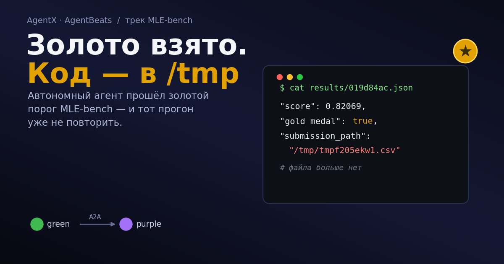
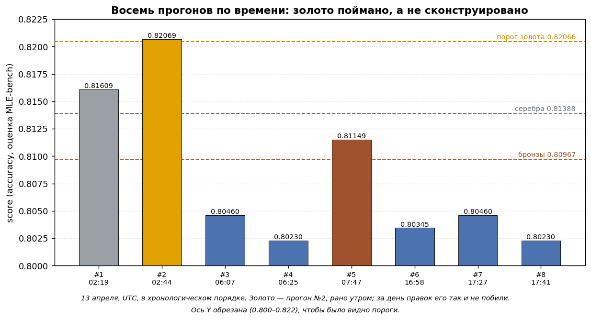

> 📄 **Опубликовано на Хабре:** https://habr.com/ru/articles/1050562/
>
> Здесь — исходник/зеркало статьи; канонический источник — Хабр.
> Картинки воспроизводимы: см. `assets/make_runs_chart.py` и `assets/make_cover.py`.


# MLE-bench: золото взято, а доказательства остались в /tmp

В апреле мой агент смог перешагнуть золотой порог на MLE-bench в агентских соревнованиях Berkeley RDI, а когда я решил показать «тот самый код, который взял золото» — понял, что не уверен, существует ли он вообще.

Хабр, привет! Меня зовут Георгий, и в своей первой статье на площадке я решил разобраться, что же происходило на самом деле. Цифровой детектив: с чем я преодолел планку, где этот результат теперь (спойлер: нигде) и сколько смысла в этом «золоте». Это история о том, как я расследовал собственную «победу».

> Про сами агентские соревнования уже хорошо написали коллеги из AI Talent Hub — пост [«Агент против агента»](https://habr.com/ru/articles/1043574/). В них агентов оценивали не по тексту ответа, а по реальным действиям — где сам бенчмарк становится агентом: зелёный агент-судья общается с твоим — фиолетовым агентом напрямую.



## Соревнование, где судья тоже агент

Соревнование [AgentX–AgentBeats](https://rdi.berkeley.edu/agentx-agentbeats.html) от Berkeley RDI проходило с осени 2025 по лето 2026: осенью команды собирали агентов-оценщиков, а весной — соревновались агенты-решатели. Больше 3400 участников второй фазы и больше десятка треков: финансы, игры, исследования, computer-use, безопасность, мультиагентность и другие. Для себя я выбрал MLE-bench — бенчмарк ML-инженерии.

[MLE-bench](https://arxiv.org/abs/2410.07095) — это набор из 75 реальных Kaggle-соревнований (изначально от OpenAI), на котором проверяют, способен ли агент пройти весь путь ML-инженера сам: прочитать данные, собрать признаки, обучить модели и отдать валидный `submission.csv`. Пороги золота, серебра и бронзы берутся из перцентилей оригинальной Kaggle-доски.

Главный твист формата: бенчмарк — сам агент. Зелёный (green) агент-оценщик выдаёт задачу фиолетовому (purple) агенту-решателю по протоколу [A2A](https://github.com/a2aproject/A2A), тот её решает, Зелёный считает результат. Человека в цикле нет.

```
Green-агент (MLE-bench)
   │  A2A: tar.gz — данные и условие задачи
   ▼
Purple-агент: LLM-петля, до 30 итераций
   модель пишет код → run_python → вывод → назад в контекст → (повтор)
   … пока в рабочей папке не появится submission.csv
   │  A2A: submission.csv (base64)
   ▼
Green-агент: метрика по скрытому тесту → сверка с порогами
```

На MLE-bench Зелёный судит механически: прогоняет метрику соревнования по скрытому тесту и сверяет с порогами. Не как в разговорных треках вроде τ²-bench — там зелёный агент сам ведёт диалог, спорит и решает, дотащил ли ты задачу. «Агенты судят агентов» здесь означает «агент ставит задачу и сводит счёт», а не «кто ему больше понравился».

Задача мне выпала классическая: [Spaceship Titanic](https://www.kaggle.com/competitions/spaceship-titanic) — бинарная классификация, ~8700 строк train и ~4300 test, метрика — accuracy. Золотой стандарт всех курсов по Data Science и соревнованиях Kaggle.

## Улика: как Зелёный передаёт задачу Фиолетовому

Мой purple-агент — сервис на FastAPI, который говорит на A2A. Зелёный присылает соревнование архивом `tar.gz` в частях A2A-сообщения (base64). Агент архив распаковывает, обрабатывает и возвращает `submission.csv` как артефакт. Распаковка идёт во временную директорию:

```python
# executor.py: достаём соревнование из частей A2A-сообщения
def _extract_input(self, message: Message) -> tuple[str, str]:
    workdir = tempfile.mkdtemp(prefix="mle_agent_")        # эфемерная папка
    instructions = ""
    for part in message.parts:
        p = part.root if hasattr(part, "root") else part
        if isinstance(p, TextPart):
            instructions += p.text + "\n"
        elif isinstance(p, FilePart) and p.file.bytes:
            raw = base64.b64decode(p.file.bytes)
            archive_path = os.path.join(workdir, "competition.tar.gz")
            with open(archive_path, "wb") as f:
                f.write(raw)
            with tarfile.open(archive_path, "r:gz") as tar:
                tar.extractall(workdir)
    return workdir, instructions                            # сюда же ляжет submission.csv
```
*Фрагмент сокращён (опущены ветка с URI и логи); целиком — в [репозитории](https://github.com/dmagog/mle-purple-agent).*

Для сервиса это нормально: пришла задача, развернули в `/tmp`, отработали, отдали ответ. `Executor` принимает задачу асинхронно, гоняет решатель в пуле потоков и стримит Зелёному события прогресса (`TaskStatusUpdateEvent`) — полноценный сервис, а не скрипт «запустил и ушёл».

## Подозреваемый: LLM-петля, которая каждый раз пишет код заново

Что у purple-агента внутри? Цикл tool-use вокруг LLM. До 30 итераций, пять инструментов (`list_files`, `read_file`, `inspect_csv`, `run_python`, `validate_submission`) поверх живого интерпретатора, где переменные и импорты сохраняются между вызовами.

```python
# ml_agent.py: модель сама пишет код и исполняет его через инструменты
for iteration in range(MAX_ITERATIONS):                 # MAX_ITERATIONS = 30
    response = client.chat.completions.create(
        model=model, messages=messages,
        tools=tool_schemas, tool_choice="auto", max_tokens=4096,
    )
    msg = response.choices[0].message
    messages.append(msg.model_dump(exclude_none=True))

    if not msg.tool_calls:                              # модель не зовёт инструменты
        if os.path.exists(submission_path):             # submission.csv готов — выходим
            break
        messages.append({"role": "user",
            "content": "Continue. If you have not yet created submission.csv, do so now."})
        continue

    for tc in msg.tool_calls:                           # run_python, inspect_csv, ...
        result = dispatch(tc.function.name, json.loads(tc.function.arguments))
        messages.append({"role": "tool", "tool_call_id": tc.id, "content": result})
```
*Здесь убраны retry и обрезка длинного вывода — суть в том, что модель сама пишет код и гоняет его через инструменты.*

Системный промпт задаёт жёсткий план по фазам: разведка данных, фичи, обучение нескольких моделей с OOF, стекинг, сабмит, тюнинг, если CV проседает. Но как именно писать код на каждой фазе — решает модель. На каждом прогоне заново.

Раз код пишется с нуля каждый раз, агент по своей природе стохастичен. За восемь прогонов скоры гуляли от 0.802 до 0.821 — с золотом, серебром и бронзой среди них.



Стабильный ли это решатель, или мне один раз повезло?

Здесь ещё наблюдение про модель, которое стоило мне нескольких бессонных прогонов. Лучше всех end-to-end вела себя средняя по размеру reasoning-модель, Gemini 2.5 Pro. Модели крупнее, которые я пробовал, работали хуже: переусложняли, уходили от плана, опускали очевидные указания, застревали в петле. Тонкий харнесс вокруг подходящей модели обыграл большую модель в тяжёлой обвязке (Opus 4.6 нещадно переизобретал Titanic). Контринтуитивно, но так вышло.

## Расследование: за чем скрывалась победа?

Вознамерившись написать статью, я задал себе наивный вопрос: «А где, собственно, код, который взял золото?»

В репозитории лежит чистый детерминированный решатель `solve_spaceship.py`, который был создан для демонстрации всей связки агента. Но апрельское золото взял не он, а LLM-петля. А где взять сам золотой `submission.csv`? В записи прогона стоит `submission_path: /tmp/tmpf205ekw1.csv`. Тот самый временный файл из раздела про A2A: он жил в эфемерной директории, никогда не сохранялся и давно стёрт. Восстановить нельзя.

Но кое-что уцелело. Перебираю восемь прогонов по дайджесту Docker-образа:

| # | Время (UTC) | Скор | Медаль | Билд |
|---|---|---------|---------|----------|
| 1 | 02:19 | 0.81609 | серебро | `a1e693…` |
| 2 | 02:44 | 0.82069 | золото | `97d33c…` |
| 3 | 06:07 | 0.80460 | — | `f52a08…` |
| 4 | 06:25 | 0.80230 | — | `d717b0…` |
| 5 | 07:47 | 0.81149 | бронза | `d5b4fc…` |
| 6 | 16:58 | 0.80345 | — | `8b2883…` |
| 7 | 17:27 | 0.80460 | — | `dad0d9…` |
| 8 | 17:41 | 0.80230 | — | `dad0d9…` |

Пороги лидерборда: золото 0.82066, серебро 0.81388, бронза 0.80967. Золото выпало рано, вторым прогоном, и за всё время правок его так и не удалось превзойти. А прогоны 7 и 8 — один и тот же билд `dad0d9…`, запущенный с разницей в 14 минут: 0.80460 и 0.80230. Тот же код, другой результат. Всего на восемь прогонов — семь разных билдов: я крутил модель и обвязку между запусками.

Ответ на вопрос — неуютный: золото поймано, а не сконструировано. Я восемь раз бросил кости, и один раз выпало золото.

На руках остался точный золотой Docker-образ (`sha256:97d33c…`), который я закрепил  git-тегом `gold-2026-04-13`. Есть независимая запись прогона у организаторов. Иными словами, рецепт и кухня сохранились, конкретное блюдо — нет. У стохастического агента тот самый прогон не повторить: даже подняв тот же образ. Получу какой-то сабмит около 0.80–0.82, но не тот самый — «золотой».

## Так что же по-настоящему значит 0.82069?

0.82069 — это оценка MLE-bench, а не место на публичной доске Kaggle. Два разных счётчика.

Для понимания масштаба: такой скор соответствует примерно топ-6% — планка золота тут не формальная. Но топ-6% — это ориентир силы скора, а не конкретное место. 

Spaceship Titanic — соревнование учебное, и медалей за него не дают вообще.

## Что я из этого вынес

Четыре вывода из расследования.

Модель оказалась важнее обвязки. Средняя reasoning-модель на тонком харнессе обошла крупные модели в тяжёлой обвязке. Если выбираете между «модель побольше» и «петля почище» — у меня выиграла вторая.

Робастность бьёт пиковую гениальность. В конкурсе, где оценивает другой агент и нет человека, который «дожмёт руками», агент, стабильно доводящий дело до валидного `submission.csv`, обыгрывает более умного, но хрупкого. Петля заточена доводить сабмит до конца: если модель замолчала, а файла нет — подталкиваю её «создай submission.csv сейчас»; если к концу итераций файла так и нет — агент падает с ошибкой, а не отдаёт мусор. Разброс восьми прогонов как раз об этом: каждый возвращал что-то валидное.

Для известных задач нужен детерминизм. Поэтому после соревнования я и написал `solve_spaceship.py` плюс быстрый путь по сигнатуре колонок (`Transported + Cabin + RoomService`): для знакомой задачи результат не должен зависеть от настроения LLM. Импровизация хороша на незнакомом, на знакомом это лишний риск.

Провенанс — это гигиена, а не паранойя. Сохраняйте `submission.csv`. Пиньте образ по `sha256`. Тегайте билд. Один `tempfile.mkdtemp` стоил мне невосстановимого золотого сабмита.

А в награду дочитавшим — одна фича из решателя, чтобы было видно: за стохастикой стоит доменная логика, а не слепой автоген. Пассажир в криосне заперт в каюте, тратить не может физически — траты и CryoSleep жёстко связаны, и это импутируется в обе стороны:

```python
# solve_spaceship.py: в крио трат быть не может — заполняем пропуски нулями
cryo_mask = combined["CryoSleep"] == True
for col in spend_cols:
    combined.loc[cryo_mask, col] = combined.loc[cryo_mask, col].fillna(0)
# и обратно: все траты по нулям, а CryoSleep пуст — значит пассажир спал
no_spend_mask = (combined[spend_cols].fillna(0).sum(axis=1) == 0) & combined["CryoSleep"].isna()
combined.loc[no_spend_mask, "CryoSleep"] = True
```

Такие фичи и тащат accuracy, а не перебор гиперпараметров.

## Что осталось людям

Хотите потрогать руками — я выложил обучающий [Kaggle-ноутбук](https://www.kaggle.com/code/georgymamarin/agents-grading-agents-spaceship-titanic-mle-bench): пошаговый разбор решателя, от EDA до стекинга трёх GBDT. Весь код агента — в репозитории [dmagog/mle-purple-agent](https://github.com/dmagog/mle-purple-agent): `SOLUTION.md`, `README`, тег `gold-2026-04-13`.

Спасибо коллегам за их [пост](https://habr.com/ru/articles/1043574/): они описали BitGN PAC1 и AgentBeats со стороны поведения агентов, я — про MLE-bench и провенанс. Вместе складывается более полная картина агентских соревнований сезона.

Автономный агент прошёл золотой порог end-to-end — это интересно само по себе. Но цена этого факта — признать стохастику, не путать площадки и сохранить хотя бы образ.

Расскажите в комментариях, как вы храните провенанс прогонов своих агентов.
